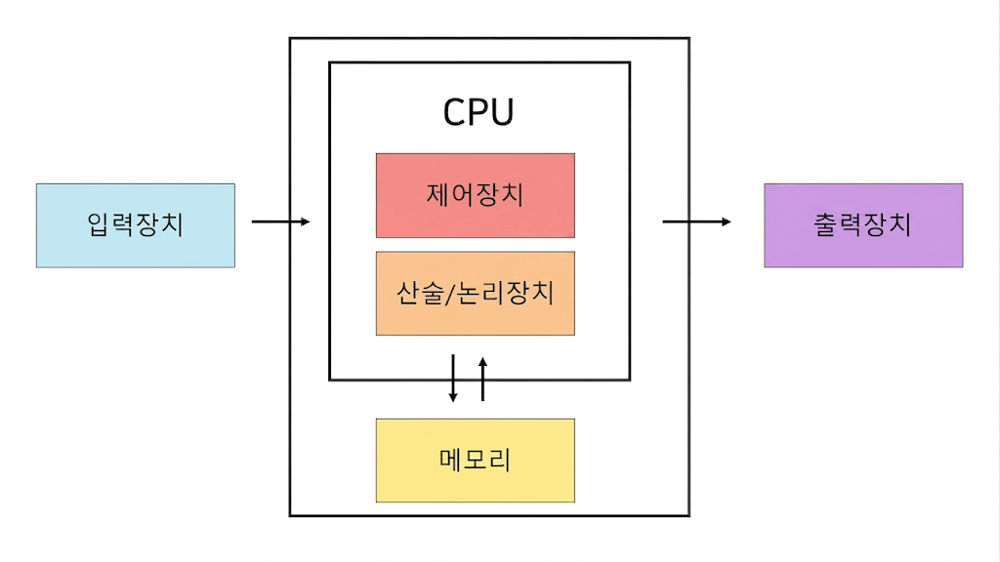

# 하드웨어(프로세서) 구조와 사양(spec)

## 폰 노이만 구조

프로세서: 소프트웨어를 실행할 수 있는 반도체(e.g. CPU, GPU, AP 등)
- 연산기와 메모리로 분리한 프로세서 구조
  - 연산 결과를 메모리에 저장하고 읽어오는 구조
  - 메모리 반도체의 경우, 데이터를 저장시키는 기능만 가지고 있기 때문에, 소프트웨어를 실행할 수 있는 반도체가 아님


### 폰 노이만 병목

#### 원인

폰 노이만 구조는 연산기(CPU)와 메모리를 분리하고, 둘 사이를 버스(Bus)라는 하나의 통로로 연결한 구조다.
- CPU가 아무리 빨라져도, 명령어와 데이터는 결국 이 좁은 통로를 통해서만 메모리를 오가야 함
- CPU의 연산 속도는 반도체 미세공정 발전에 따라 매년 빠르게 향상되어온 반면, 메모리(DRAM)의 속도는 상대적으로 느리게 개선됨
- 그 결과 CPU가 계산을 끝내고 다음 데이터를 기다리며 대기하는 시간이 발생 → 이 통로가 전체 시스템 성능의 병목(Bottleneck)이 됨

즉, "연산기와 메모리를 분리한다"는 폰 노이만 구조의 핵심 설계 자체가, 구조적으로 병목을 안고 갈 수밖에 없는 원인이 된다.

#### 한계와 해결책

- **캐시 메모리(Cache) 계층 도입**
  - CPU와 메인 메모리(DRAM) 사이에, 훨씬 빠르지만 용량이 작은 캐시(L1/L2/L3)를 둠
  - 자주 쓰는 데이터를 캐시에 저장해두고, CPU가 메인 메모리까지 가지 않고 캐시에서 바로 가져오게 함으로써 병목 완화
  - 다만 캐시는 근본적인 해결책이 아니라, 병목을 줄이는 완충 장치(buffer)에 가까움

- **메모리 계층 구조(Memory Hierarchy)**
  - 레지스터 → 캐시 → 메인 메모리 → 보조기억장치 순으로, 빠르지만 비싼 저장장치와 느리지만 저렴한 저장장치를 계층화
  - 자주 쓰는 데이터일수록 빠른 계층에 두는 방식으로 평균 접근 속도를 개선

- **구조적 대안: 하버드 구조(Harvard Architecture)**
  - 명령어(Instruction)와 데이터(Data)를 저장하는 메모리 자체를 분리하고, 각각에 독립된 버스를 부여
  - 명령어를 가져오는 동시에 데이터도 가져올 수 있어 병목이 줄어듦
  - 다만 회로가 복잡해지고 비용이 늘어나는 단점 → 최근 CPU는 폰 노이만과 하버드 구조를 절충한 형태(캐시 단계에서만 하버드처럼 명령어/데이터를 분리)를 많이 사용

- **최근 동향**
  - HBM(High Bandwidth Memory): GPU 등 대규모 병렬 연산 환경에서, 메모리를 프로세서에 물리적으로 가깝게 적층해 대역폭을 획기적으로 늘린 방식
  - PIM(Processing-In-Memory): 아예 메모리 반도체 안에 간단한 연산 기능을 넣어, 데이터를 CPU로 옮기지 않고 메모리 내부에서 처리하는 방식 → 폰 노이만 구조 자체의 "연산기-메모리 분리"라는 전제를 깨려는 시도

- **뉴로모픽 컴퓨팅(Neuromorphic Computing): 구조 자체를 뇌처럼 바꾸는 접근**
  - 폰 노이만 구조는 "연산기와 메모리를 분리"하지만, 인간의 뇌는 애초에 이런 분리가 없음
    - 뇌의 뉴런(Neuron)과 시냅스(Synapse)는 하나의 단위에서 저장과 연산을 동시에 수행함
    - 즉, 뇌는 "메모리를 오가며 계산하는" 구조가 아니라 "저장 장소 자체가 곧 연산 장치"인 구조
  - 이 원리를 반도체로 구현하려는 것이 뉴로모픽 칩
    - 연산기와 메모리를 아예 물리적으로 통합해서, 데이터를 옮기는 과정 자체를 없애버리는 방식
    - 폰 노이만 병목의 근본 원인("연산기-메모리 분리")을 캐시나 계층 구조로 완화하는 게 아니라, 구조 자체를 다르게 설계해서 우회하는 접근
  - 대표 사례
    - IBM TrueNorth: 뉴런과 시냅스 구조를 모방한 초기 뉴로모픽 칩
    - Intel Loihi: 스파이킹 뉴럴 네트워크(Spiking Neural Network, 실제 뉴런의 발화 방식을 모사)를 처리하도록 설계된 칩
  - 장점: 기존 구조 대비 훨씬 적은 전력으로 패턴 인식, 감각 정보 처리 같은 작업을 수행 가능 (뇌가 실제로 저전력으로 작동하는 것과 같은 원리)
  - 한계: 아직 범용 연산(일반적인 프로그램 실행)에는 적합하지 않아, 특정 AI/센서 처리 용도로 연구·적용되는 단계
---

## AP 등장의 배경

스마트폰 등장 이전에 피처폰이 있었다. 이 때만 해도 음성 통화와 SMS가 주요 기능이었고, 지금의 스마트폰처럼 디바이스 위에서 앱을 많이 돌리는 일은 많이 없었다. 그래서 모뎀칩(베이스밴드 프로세서)이 핵심이었고, 통화, SMS 처리와 아주 단순한 연산까지 겸했다.

스마트폰 초기(아이폰 1세대, 2007년)만 해도 앱스토어 자체가 없었지만, 다음해 앱스토어가 생기며 서드파티 앱들이 폭발적으로 늘어났다. 스마트폰에서 다뤄야하는 앱이 많아지고 복잡해질수록 처리해야할 연산량이 많아지게 되었는데, 기존 모뎀칩만으로는 감당할 수 없었다. 그리고 이 문제를 해결하기 위해 AP가 등장했다.

AP는 저전력 및 고효율이 강점인 ARM 코어를 기반으로, CPU + GPU + ISP(이미지 신호 처리) + NPU 등을 하나의 칩에 통합한 SoC(System on Chip) 형태로 발전했다. 대표적으로 퀄컴 스냅드래곤, 애플 A시리즈, 삼성 엑시노스가 있다.

---

## GPU 등장의 배경

초기의 컴퓨터에서는 CPU가 거의 모든 계산을 담당했고, 그래픽 계산도 마찬가지였다.

그런데 1990년대 3D 게임(예: Doom, Quake)과 GUI 환경이 보급되면서 문제가 생겼다.
화면에 수많은 픽셀을 그리려면 비슷한 계산을 엄청나게 많이 반복해야 했기 때문이다.

예를 들어 1920×1080 화면에는 약 207만 개의 픽셀이 있다.각 픽셀의 색상을 계산해야 한다면, "이 픽셀은 어떤 색이어야 하지?"라는 계산을 200만 번 이상 해야한다.
그런데 이 일을 CPU가 맡으니 여러 문제가 동시에 터졌다. 

- 속도 문제: CPU는 코어 수가 적어서, 수백만 픽셀을 순서대로 처리하다 보니 제때 다 못 그려서 화면이 끊기고 버벅거림
- 역할 충돌 문제: CPU가 픽셀 계산에 묶여있으면 게임 로직, 네트워크 처리 같은 다른 중요한 일을 처리할 여력이 없어짐
- 실시간성 붕괴: 화면은 실시간으로 매끄럽게 바뀌어야 하는데, 계산이 밀리면 그 지연이 눈에 바로 보임
- 비효율: CPU 코어는 복잡한 작업에 최적화된 무겁고 정교한 구조라, 단순 반복인 픽셀 계산을 시키기엔 전력 대비 효율이 나빴음

그리고 그래픽 계산에서 중요한 특징이 발견되었는데, 예를 들어 다음과 같은 계산을 한다고 생각해보자.
```
픽셀 1 → 계산
픽셀 2 → 계산
픽셀 3 → 계산
픽셀 4 → 계산
...
픽셀 200만 → 계산
```

각 픽셀의 계산은 서로 독립적인 경우가 많다. -> 데이터 의존성이 낮다는 점이다. 즉, 화면 왼쪽 위 픽셀의 색상을 구하는 계산과 오른쪽 아래 픽셀을 구하는 계산은 서로 영향을 주지 않는 대규모 병렬 문제(Embarrassingly Parallel Problem)다.


그리고 이 문제는 병렬 처리로 해결할 수 있었다.
```
픽셀 1 계산 ─┐
픽셀 2 계산 ─┤
픽셀 3 계산 ─┤ → 동시에 처리할 수 있음
픽셀 4 계산 ─┤
픽셀 5 계산 ─┘
```

이러한 특성에 맞춰 1999년 NVIDIA가 GeForce 256을 선보이며 GPU라는 명칭과 개념을 대중화했다.

- 구조적 차이: 복잡한 제어 회로(Control Logic)와 캐시 메모리 비중을 줄이는 대신, 단순 연산을 수행하는 ALU(Arithmetic Logic Unit)를 수천 개 집적했다.
- 역할 분담: CPU는 직렬 제어와 복잡한 로직을 맡고, 단순 행렬/수치 연산 반복은 GPU가 맡아 병렬로 한 번에 처리하게 되었다.

### GPU가 AI 기술의 핵심이 된 원리와 역사적 맥락

#### 연산의 본질적 동일성: 픽셀 계산 = 행렬 곱셈 = AI 연산

- 3D 그래픽스의 본질: 3D 공간의 캐릭터나 물체를 화면에 그리기 위해서는 물체의 위치를 이동시키고, 회전시키고, 조명을 적용해야 한다. 이 모든 과정은 수많은 3D 좌표 Vector에 4x4 변환 Matrix를 곱하는 행렬 곱셈(Matrix Multiplication)이다.
- 딥러닝의 본질: 인공신경망의 기본 단위인 Perceptron이 수행하는 연산은 입력값(X)과 가중치(W)를 곱하고 편향(b)을 더하는 연산($Y = WX + b$)이다. 데이터가 거대해지면 이 연산은 수천, 수만 차원의 대규모 행렬 곱셈으로 직결된다.
- 결론: GPU 입장에서 "3D 캐릭터의 빛을 계산하는 것"과 "AI 모델이 데이터의 패턴을 학습하는 것"은 컴퓨터 내부에서 완전히 똑같은 **대규모 행렬 연산 병렬 처리** 작업

---

## 프로그램과 ISA

## 프로그램

프로그램은 프로세서 명령어(instruction)들의 나열이다.
- 프로세서에서 수행할 수 있는 기능을 표시: 덧셈, 곱셈 등 CPU가 순서대로 실행할 명령어들의 목록
- 프로세에 포함된 하드웨어에 의해 결정됨: 덧셈기가 있으면 덧셈을 명령어로 포함시킬 수 있다. 반대로 나눗셈기가 없다면, 나눗셈은 명령어로 포함시킬 수 없다.

### 실행 방식
- CPU는 메모리에 저장된 명령어를 프로그램 카운터(PC)가 가리키는 순서대로 하나씩 가져옴(fetch)
- 가져온 명령어를 해석(decode)하고 실행(execute)
- 이 fetch-decode-execute 사이클이 반복되면서 프로그램이 동작함

## ISA

CPU가 이해하고 실행할 수 있는 모든 명령어의 집합으로, CPU(하드웨어)와 소프트웨어 사이의 인터페이스 역할을 수행한다.
ISA는 CPU의 언어로,프로그래머가 작성한 프로그래밍 언어를 컴파일러(또는 인터프리터)가 해당 프로세서의 ISA가 정의한 형태의 기계어로 번역하고, 그걸 CPU가 실행한다.
- ISA는 기계어의 형태이다.

```
프로그래밍 언어 (C, Python, Java 등)
            ↓
컴파일러/인터프리터가 "해당 프로세서의 ISA가 정의한 형태"에 맞춰 번역
            ↓
기계어 (ISA 규칙을 따르는 0과 1의 명령어 나열)
            ↓
CPU가 fetch → decode → execute
```
